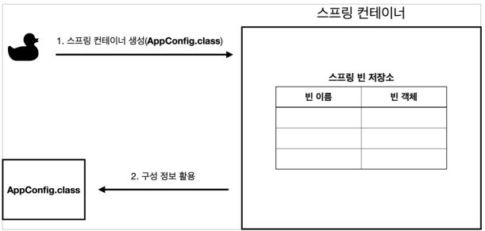
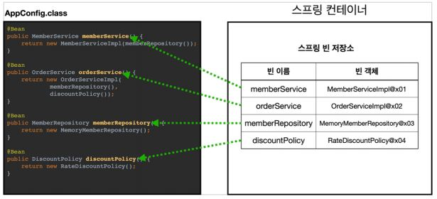
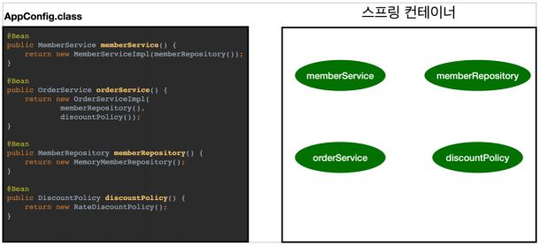
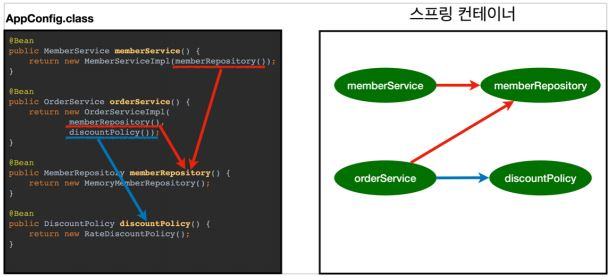

# 스프링 핵심 원리

> [인프런, 스프링 핵심 원리](https://www.inflearn.com/course/%EC%8A%A4%ED%94%84%EB%A7%81-%ED%95%B5%EC%8B%AC-%EC%9B%90%EB%A6%AC-%EA%B8%B0%EB%B3%B8%ED%8E%B8)

## 스프링의 등장 배경

2000년대 초반에 EJB(Enterprise Java Beans)가 대세였는데 EJB의 장점은 현재 스프링이 지원하는 선언적 트랜잭션, JPA 기술 등 여러가지가 있었지만 복잡하고 비싸고 느리다는것이었다.

그래서 나타난게 스프링과 Hibernate 이다.

> EJB 엔티티빈 - Hibernate - JPA(표준 인터페이스) 
>
> JPA 구현체로는 Hibernate 가 80% 이상이다.

스프링은 `로드 존슨`이 2002년 출간한 책에 3만줄 이상되는 예제를 통해 현재 스프링의 기반이 되는 ApplicationContext, BeanFactory, DI 등의 기술을 사용하여 EJB 없이 프로젝트를 할 수 있다는 걸 보여줬고, 책 출간 직후 `유겐 휠러` 와 `얀 카로프` 가 로드 존슨에게 오픈소스를 제안한다.

## 스프링 릴리즈

- 2003년 스프링 프레임워크 1.0 출시 - XML
- 2006년 스프링 프레임워크 2.0 출시 - XML 편의 기능 지원
- 2009년 스프링 프레임워크 3.0 출시 - 자바 코드로 설정
- 2013년 스프링 프레임워크 4.0 출시 - 자바 8
- 2014년 스프링 부트 1.0 출시 
- 2017년 스프링 프레임워크 5.0, 스프링 부트 2.0 출시 - 리액티브 프로그래밍 지원
- 2020년 스프링 프레임워크 5.2.X, 스프링 부트 2.3.X 출시

## 스프링 핵심 컨셉

- 스프링은 자바 언어 기반 프레임워크
- 자바 언어의 가장 큰 특징 - `객체지향`
- 스프링은 `객체지향언어`가 가진 강력한 특징을 살려내는 프레임워크
- 스프링은 `좋은 객체 지향` 애플리케이션을 개발할 수 있도록 도와주는 프레임워크

## 좋은 객체지향 프로그래밍 이란?

- 객체 지향 프로그래밍은 컴퓨터 프로그램을 명령어의 목록으로 보는 시각에서 벗어나 여러개의 독립된 단위, 즉 "객체"들의 `모임`으로 파악하고자 하는 것이다. 각각의 객체는 `메시지`를 주고받고, 데이터를 처리할 수 있다. (`협력`)
- 객체 지향 프로그래밍은 프로그램을 `유연`하고 `변경`이 용이하게 만들기 때문에 대규모 소프트웨어 개발에 많이 사용된다.
  - 유연하고 변경에 용이하다는 것은? 
    - 컴퓨터 부품을 갈아 끼우듯이 컴포넌트를 쉽고 유연하게 변경하면서 개발할 수 있어야 한다.
    - 따라서 가장 중요한 객체지향의 특징은 `다형성(polymorphism)` 이다.
    
## 다형성(polymorphism) = 객체지향의 꽃 

### 역할(interface)과 구현(implementation)

- 역할(interface)과 구현(implementation)으로 구분
  - ex) 운전자(역할) - 자동차(역할) - 자동차(구현)
    - 운전자(클라이언트)는 자동차 역할에 의존하지 구현에 의존하지 않는다.
    - 핵심은 자동차가 많은 구현을 할 수 있다는 것이 아니라, `어떠한 자동차가 나와도 클라이언트에 영향을 주지않고 새로운 기능을 추가할 수 있다는 것이다`. 
  - ex) 로미오(역할) - 줄리엣(역할) ... 로미오(원빈, 장동건, 정우성 등), 줄리엣(송혜교, 김다미, 박소담 등)
    - 로미오와 줄리엣은 배우가 될 수도 있고, 어떤 다른 사람이 와도 상관없다. 즉, 대체 가능해야한다.
- 역할과 구현으로 세상을 구분했을 때의 장점
  - 클라이언트는 대상의 역할(인터페이스)만 알면 된다.
  - 클라이언트는 구현 대상의 내부 구조를 몰라도 된다.
  - 클라이언트는 구현 대상의 내부 구조가 변경되어도 영향을 받지 않는다.
  - 클라이언트는 구현 대상 자체를 변경해도 영향을 받지 않는다.
- 객체를 설계할 때 `역할`과 `구현`을 명확하게 분리해야한다.
- 객체 설계 시 역할을 먼저 부여하고, 그 다음 그 역할을 수행하는 구현을 만든다.

### 객체의 협력이라는 관계부터 생각

- 혼자있는 객체는 없다.
  - 다형성을 공부하면서 이런 생각을 할 수가 있다. 부모(Interface)가 있고 그걸 구현한 구현체들이 있는데 클라이언트는 없네? 라고 생각할 수 있는데, 클라이언트는 요청하는 사람, 서버는 응답하는 사람이라고 생각할 수 있다.
- 클라이언트 : 요청, 서버: 응답
- 수 많은 클라이언트와 서버는 서로 협력 관계를 가진다.

### 오버라이딩

- 다형성으로 인터페이스를 구현한 객체를 실행 시점에서 유연하게 변경할 수 있다. 
  - ex) 추상 팩토리 패턴과 전략패턴을 사용한 경우
  
### 다형성의 본질
 
- 다형성으로 인터페이스를 구현한 객체를 실행 시점에서 유연하게 변경할 수 있다. 
  - 따라서 인터페이스를 잘 설계하는 것이 중요하다.
- 다형성의 본질을 이해하려면 `협력`이라는 객체 사이의 관계에서 시작해야한다.
- `클라이언트를 변경하지 않고 서버 기능을 유연하게 변경할 수 있다.`

```java
public class UserService {
  
  // private UserRepository userRepository = new UserJoinRepository();
  private UserRepository userRepository = new UserFindRepository();
  
}
``` 

위 코드에서 클라이언트는 UserService 가 되며, 서버는 UserRepository(역할) 가 된다. 구현은 UserJoinRepository 와 UserFindRepository 이다.
위 코드는 다형성을 제대로 활용하지 못한 사례이다. Repository 구현체를 바꾸기 위해서는 클라이언트의 코드를 수정해야한다.

- MailService (역할)
  - sendMail() (추상메서드)
  - MailExternalService(외부망전용)
  - MailInternalService(내부망전용)
  
```java
public class MailVO {

  private String uniqueNo; // 사번 및 회원 ID
  private String title; // 제목
  private String content; // 내용
  
  // 생략
  
}
```

```java
@Controller
public class MailController {

  @PostMapping("/sendMail")
  public String sendMail(MailVO mailVO) {
      // 실행 시점에 클라이언트를 변경하지 않고 서버의 기능을 유연하게 변경할 수 있다.
      MailService mailService = MailServiceFactory.findMailService(mailVO);
      mailService.sendMail();
      // 생략
  }

}
```

여기서 클라이언트는 MailController 이며 역할은 MailService 구현은 MailExternalService 와 MailInternalService 이다. 추상 팩토리 패턴을 통해서 mailVO 안에 있는 uniqueId 를 통해서

MailServiceFactory.findMailService 내부에서는 findEmployee 메서드를 실행한다. (where uniqueId = #uniqueId#) 만약에 findEmployee 의 결과가 null 이면 외부망이고 null 이 아니면 내부망
이라고 판단해서 메일을 발송한다.

## 스프링과 다형성

- 스프링은 다형성을 극대화하여 이용할 수 있게 해준다.
- 스프링의 IoC, DI 는 다형성을 활용해서 역할과 구현을 편리하게 다룰 수 있도록 해준다.
- 스프링을 사용하면 구현을 편리하게 변경할 수 있다.

> 즉, 스프링의 핵심은 좋은 객체지향 프로그래밍을 할 수 있게 도와주는 도구이며 객체지향의 꽃은 다형성이고, 따라서 스프링에서 가장 중요한 요소는 IoC, DI 이며, 스프링은 다형성을 편리하게 사용할 수 있도록 해주는 도구이다.

## 좋은 객체 지향 설계 원칙 : SOLID

- SRP(Single Resposibility Principle, 단일 책임 원칙)
- OCP(Open/Closed Principle, 개방 폐쇄 원칙) : 가장 중요한 원칙 1.
- LSP(Liskov Substitution Principle, 리스코프 치환 원칙)
- ISP(Interface Segregation Principle, 인터페이스 분리 원칙)
- DIP(Dependency Inversion Principle, 의존관계 역전 원칙) : 가장 중요한 원칙 2.

### SRP

- 한 클래스는 하나의 책임만 져야 한다.
- 하나의 책임이라는 것은 모호하다. (문맥과 상황에 따라 다르다.)
- `중요한 기준은 변경`이다. 변경이 있을때 파급 효과가 작으면 단일 책임 원칙을 잘 따른 것.
- ex) UI 변경, 객체의 생성과 사용을 분리

### OCP

- 소프트웨어 요소는 `확장(새로운 기능 추가)에는 열려` 있어야 하며, `변경(기존 코드의 변경)에는 닫혀` 있어야 한다.
  - 즉, 기존 코드의 변경 없이 새로운 기능을 추가
  - 인터페이스를 구현한 새로운 클래스를 만들어 새로운 기능을 구현
- 다형성 활용
- UserService 클라이언트가 구현 클래스를 직접 선택
  - 기존 코드의 변경이 일어남
  - 구현 객체를 변경하기 위해서 기존 코드를 변경해야함
  - 다형성을 사용했지만 OCP 를 지키지 못함
- 해결 방법
  - `객체를 생성하고 연관 관계를 맺어주는 별도의 조립 설정자가 필요함`
  
```java
public class UserService {
  
  // private UserRepository userRepository = new UserJoinRepository();
  private UserRepository userRepository = new UserFindRepository();
  
}
```

### LSP

- 프로그램 객체는 프로그램의 정확성을 깨뜨리지 않으면서 하위 타입의 인스턴스로 바꿀 수 있어야 한다.
- 다형성에서 하위 클래스는 `인터페이스 규약`을 다 지켜야한다. 다형성을 지원하기 위한 원칙. 
- 인터페이스를 구현한 구현체를 믿고 사용하려면 이 원칙이 필요하다.
- 단순히 컴파일 성공하는 것을 넘어서는 이야기
- ex) 자동차 엑셀은 앞으로 가야함. 뒤로 가게 만들면 LSP 원칙 위반. 느리더라도 앞으로 가야 함.

### ISP

- 특정 클라이언트를 위한 여러개의 인터페이스가 하나의 범용 인터페이스보다 낫다.
- 자동차 인터페이스 -> 운전 인터페이스, 정비 인터페이스로 분리
- 사용자 인터페이스 -> 운전자 클라이언트, 정비사 클라이언트로 분리
- 인터페이스를 분리하면 정비 인터페이스가 변경되어도 운전자에게 영향을 미치지 않음
- `인터페이스가 명확해지고 대체 가능성이 높아진다.`

### DIP

- 프로그래머는 `추상화에 의존해야지 구체화에 의존하면 안된다.`
  - 즉, 구현체에 의존하지 말고 인터페이스에 의존하라는 의미
  - 앞서 말한, `역할에 의존하게 해야한다는 것`과 같다.
  - 역할과 구현을 철저하게 분리 해야 한다.

```java
public class UserService {
  
  // private UserRepository userRepository = new UserJoinRepository();
  private UserRepository userRepository = new UserFindRepository();
  
}
```

UserService 는 인터페이스에 의존하지만 구현 클래스에도 동시에 의존한다. `클라이언트가 구현체를 직접 선택 : DIP 위반`

> 다형성 만으로는 OCP, DIP 를 지킬 수 없다.

## 객체지향설계와 스프링

- 스프링은 DI(Dependency Injection, 의존관계 주입, 의존성 주입)를 통해 `다형성 + OCP, DIP` 를 지원
- 클라이언트 코드 변경 없이 쉽게 기능 확장

순수하게 자바로 OCP, DIP 를 지키면서 만들다 보면 결국엔 스프링 프레임워크 DI 컨테이너를 만들게 된다.

> 인터페이스를 먼저 다 만들어 놓고 구현체를 만들게 되면 장점이, 기술 선택을 미룰 수 있다. 예를 들어 JDBC 를 쓸건지 JPA 를 쓸건지 안 정해졌어도 나중에 JDBCRepository or JPARepository
구현체를 만들어 사용하면된다.

## 실무

- 인터페이스를 도입하면 추상화라는 비용이 발생한다. (성능 문제는 아님)
  - 런타임시에 구체클래스가 선택되는데 클릭해서 들어가면 인터페이스만 있기 때문에 한번 더 들어가야 구체클래스가 뭔지 알 수 있다.
- 기능을 확장할 가능성이 없다면, 구체 클래스를 직접 사용하고, 향후 꼭 필요할 때 리팩토링해서 도입하는 것도 방법이다.

## 다이어그램

프로젝트 개발에 앞서 보통 3가지를 먼저 작성하는데 `도메인 협력관계`, `클래스 다이어그램`, `객체 다이어그램`

- 도메인 협력 관계
  - 기회자들도 볼 수 있음
- 클래스 다이어그램
  - 클래스 간의 관계 (정적)
- 객체 다이어그램
  - 실제로 new 로 만들어서 이루어지는 객체간의 다이어그램 (동적)
  
## IoC(Inversion of Control)

- IoC(Inversion of Control, 제어의 역전)
  - 프로그램의 제어 흐름을 직접 제어하는 것이 아니라 외부에서 관리하는 것을 제어의 역전(IoC)이라고 한다.

```java
@RequiredArgsConstructor
@RequestMapping("/user")
@Controller
public class UserController {

  /**
   * @Resource(name = "userService")
   * private UserService userService;
   *
   * @Autowired
   * private UserService userService;
   */
   
   private final UserService userService;
   
   public String join(User user) {
      // 생략
      userService.join(user);
      // 생략
   }

}
```

위 코드에서 UserController 는 UserService 에 어떤 구현 객체가 들어오고 의존성이 주입되는지 알지도 못한체 묵묵하게 자신이 할 일을 수행할 뿐이다. 이렇게 프로그램의 제어 흐름을 직접 제어하는 것이 아니라 외부에서 관리하는 것을 제어의 역전(IoC) 라고한다.

위 코드에서 프로그램의 제어 흐름을 제어하는 곳은 `DI 컨테이너`가 담당한다.

> 프레임워크 VS 라이브러리
>
> 프레임워크가 내가 작성한 코드를 제어하고, 대신 실행하면 그것은 프레임워크가 맞다. (JUnit)
> 
> 반면에 내가 작성한 코드가 직접 제어의 흐름을 담당한다면 그것은 프레임워크가 아니라 라이브러리다.

## DI(Dependecy Injection, 의존 관계 주입)

의존성 주입, 의존 관계 주입이라는 말이 있는데 `의존관계 주입`이라는 말이 더 와닿는다. 왜냐하면 의존은 객체들끼리의 관계가 중요하기 때문이다.

IoC 예제에서 UserController 는 UserService 인터페이스에 의존한다. 실제 어떤 구현 객체가 사용될지는 모른다.

- 의존관계는 `정적인 클래스 의존 관계와, 실행 시점에 결정되는 동적인 객체(인스턴스) 의존 관계` 둘을 분리해서 생각해야 한다.

### 정적인 클래스 의존 관계

클래스가 사용하는 import 코드만 보고 의존 관계를 쉽게 판단할 수 있다. 정적인 의존관계는 애플리케이션을 실행하지 않아도 분석할 수 있다.

UserController 는 UserService 인터페이스에 의존한다. (import 를 보면 알 수 있다.) 그런데 이러한 클래스 의존 관계 만으로는 실제 어떤 객체가
주입되는지 알수 없다.

### 동적인 객체 인스턴스 의존 관계

애플리케이션 실행 시점에 실제 생성된 객체 인스턴스의 참조가 연결된 의존 관계다.

- 애플리케이션 실행 시점(런타임)에 외부에서 실제 구현 객체를 생성하고 클라이언트에 전달해서 클라이언트와 서버의 실제 의존관계가 연결 되는 것을 의존관계 주입이라 한다.
- 객체 인스턴스를 생성하고, 그 참조값을 전달해서 연결된다.
- 의존관계 주입을 사용하면 클라이언트 코드를 변경하지 않고, 클라이언트가 호출하는 대상의 타입 인스턴스를 변경할 수 있다.
- 의존관계 주입을 사용하면 정적인 클래스 의존관계를 변경하지 않고, 동적인 객체 인스턴스 의존관계를 쉽게 변경할 수 있다.

## IoC 컨테이너, DI 컨테이너

- IoC 컨테이너, DI 컨테이너
  - AppConfig 처럼 객체를 생성하고 관리하면서 의존관계를 연결해 주는 것을
  - IoC 컨테이너 또는 DI 컨테이너라 한다.
  - 의존관계 주입에 초점을 맞추어 `최근에는 주로 DI 컨테이너`라 한다.
  - 또는 어샘블러, 오브젝트 팩토리 등으로 불리기도 한다.

## 스프링 컨테이너(ApplicationContext)

- ApplicationContext 를 스프링 컨테이너라 한다.
- ApplicationContext 는 인터페이스이다.
- 스프링 컨테이너는 XML을 기반으로 만들 수 있고, 어노테이션 기반의 자바 설정 클래스로 만들 수 있다. 직전에 AppConfig 를 사용했던 방식이 어노테이션 기반의 자바 설정 클래스로 스프링 컨테이너를 만든 것이다.

- 자바 설정 클래스를 기반으로 스프링 컨테이너(ApplicationContext)를 만들어보자.
  - new AnnotationConfigApplicationContext(AppConfig.class);
  - 이 클래스는 ApplicationContext 인터페이스의 구현체이다.

> 참고: 더 정확히는 스프링 컨테이너를 부를 때 `BeanFactory, ApplicationContext` 로 구분해서 이야기한다. 이 부분은 뒤에서 설명하겠다. BeanFactory 를 직접 사용하는 경우는 거의 없으므로 일반적으로 ApplicationContext 를 스프링 컨테이너라 한다.

- AppConfig 
  - `@Configuration` 어노테이션을 이용해서 설정 파일임을 나타내고 `@Bean` 어노테이션을 이용해서 스프링 컨테이너에 빈으로 등록해준다.
  
```java
/**
 * AppConfig.java
 * 애플리케이션에 대한 전반적인 동작 방식(환경 설정)
 * 구현 객체 생성 담당 및 생성자를 통한 주입
 */
@Configuration
public class AppConfig {

    /**
     * @Bean 어노테이션은 name 속성을 따로 지정하지 않으면
     * Ex) @Bean(name="memberService2")
     * default 로 메서드명을 name 으로 지정한다.
     */
    @Bean
    public MemberService memberService() {
        return new MemberServiceImpl(memberRepository());
    }

    @Bean
    public MemberRepository memberRepository() {
        return new MemoryMemberRepository();
    }

    @Bean
    public OrderService orderService() {
        return new OrderServiceImpl(memberRepository(), discountPolicy());
    }

    @Bean
    public DiscountPolicy discountPolicy() {
        // return new FixDiscountPolicy();
        return new RateDiscountPolicy();
    }

}
```

> 주의: 빈 이름은 항상 다른 이름을 부여해야 한다. 같은 이름을 부여하면, 다른 빈이 무시되거나, 기존 빈을
덮어버리거나 설정에 따라 오류가 발생한다.

- MemberApp.java 

아래 코드를 관심있게 보면 된다. ApplicationContext 는 ac 라는 네이밍으로도 자주 사용

```java
// AppConfig 에 Bean 으로 등록되어있는 애들을 스프링 컨테이너에 넣어서 관리해준다.
// 스프링 컨테이너는 파라미터로 넘어온 설정 클래스 정보를 사용해서 스프링 빈을 등록한다.
ApplicationContext ac = new AnnotationConfigApplicationContext(AppConfig.class);
MemberService memberService = ac.getBean("memberService", MemberService.class); // memberService 는 Bean 으로 등록된 메서드 이름
```        
        

```java
public class MemberApp {

    public static void main(String[] args) {
        // pure java version
//        AppConfig appConfig = new AppConfig();
//        MemberService memberService = appConfig.memberService();

        // spring version
        // AppConfig 에 Bean 으로 등록되어있는 애들을 스프링 컨테이너에 넣어서 관리해준다.
        ApplicationContext ac = new AnnotationConfigApplicationContext(AppConfig.class);
        MemberService memberService = ac.getBean("memberService", MemberService.class); // memberService 는 Bean 으로 등록된 메서드 이름

        Member member = new Member(1L, "memberA", Grade.VIP);
        memberService.join(member);

        Member findMember = memberService.findMember(1L);
        System.out.println(findMember.getName());
        System.out.println(member.getName());

    }

}
```

## 스프링 컨테이너의 의존성 주입 단계

### 1. 스프링 컨테이너 생성



### 2. 스프링 빈 등록



### 3. 스프링 의존 관계 설정 준비



### 4. 스프링 의존 관계 설정 완료



## 스프링 빈 조회

- ac.getBean(빈이름, 타입)
- ac.getBean(타입)
- 조회 대상 스프링 빈이 없으면 예외 발생
  - `NoSuchBeanDefinitionException: No bean named 'xxxxx' available`
  
## 스프링 빈 조회 - 상속 관계

- 부모 타입으로 조회하면, 자식 타입도 함께 조회된다.
- 그래서 모든 자바 객체의 최고 부모인 Object 타입으로 조회하면, 모든 스프링 빈을 조회한다.

## BeanFactory 와 ApplicationContext


> AnnotationConfig, ApplicationContext -> ApplicationContext(interface) -> BeanFactory(interface)

- `BeanFactory`
  - 스프링 컨테이너의 최상위 인터페이스이다.
  - 스프링 빈을 관리하고 조회하는 역할을 담당한다.
  - getBean() 을 제공한다.
  - 위에서 지금까지 사용했던 대부분의 기능은 BeanFactory 가 제공하는 기능이다.
  
- `ApplicationContext`
  - BeanFactory 기능을 모두 상속받아서 제공한다.
  - 빈을 관리하고 검색하는 기능을 BeanFactory 가 제공해주는데, 그러면 둘의 차이가 뭘까?
  - 애플리케이션을 개발할 때는 빈은 관리하고 조회하는 기능은 물론이고, 수 많은 부가기능이 필요하다. 
  
  
  
- `ApplicatonContext가 제공하는 부가기능`
  - `메시지소스를 활용한 국제화 기능`
    - 예를 들어서 한국에서 들어오면 한국어로, 영어권에서 들어오면 영어로 출력
  - `환경변수`
    - 로컬, 개발, 운영등을 구분해서 처리
  - `애플리케이션 이벤트`
    - 이벤트를 발행하고 구독하는 모델을 편리하게 지원
  - `편리한 리소스 조회`
    - 파일, 클래스패스, 외부 등에서 리소스를 편리하게 조회

- ApplicationContext는 BeanFactory의 기능을 상속받는다.
- ApplicationContext는 빈 관리기능 + 편리한 부가 기능을 제공한다.
- BeanFactory를 직접 사용할 일은 거의 없다. 부가기능이 포함된 ApplicationContext를 사용한다.
- BeanFactory나 ApplicationContext를 스프링 컨테이너라 한다.

## 다양한 설정 형식 지원 - 자바코드, XML

- 프링 컨테이너는 다양한 형식의 설정 정보를 받아드릴 수 있게 유연하게 설계되어 있다.
  - 자바 코드, XML, Groovy 등등

  

### 어노테이션 기반 자바 코드 설정

- new AnnotationConfigApplicationContext(AppConfig.class)
- AnnotationConfigApplicationContext 클래스를 사용하면서 자바 코드로된 설정 정보를 넘기면 된다.

### XML 설정 사용

> 자세한건 공식 레퍼런스 참고 https://spring.io/projects/spring-framework

- 최근에는 스프링 부트를 많이 사용하면서 XML기반의 설정은 잘 사용하지 않는다. 아직 많은 레거시 프로젝
트 들이 XML로 되어 있고, 또 XML을 사용하면 컴파일 없이 빈 설정 정보를 변경할 수 있는 장점도 있으므
로 한번쯤 배워두는 것도 괜찮다.
- GenericXmlApplictionContext 를 사용하면서 xml 설정 파일을 넘기면 된다.

- src/main/resources/appConfig.xml

```xml
<?xml version="1.0" encoding="UTF-8"?>
<beans xmlns="http://www.springframework.org/schema/beans"
 xmlns:xsi="http://www.w3.org/2001/XMLSchema-instance"
 xsi:schemaLocation="http://www.springframework.org/schema/beans http://
www.springframework.org/schema/beans/spring-beans.xsd">
 <bean id="memberService" class="hello.core.member.MemberServiceImpl">
 <constructor-arg name="memberRepository" ref="memberRepository" />
 </bean>
 <bean id="memberRepository"
class="hello.core.member.MemoryMemberRepository" />
 <bean id="orderService" class="hello.core.order.OrderServiceImpl">
 <constructor-arg name="memberRepository" ref="memberRepository" />
 <constructor-arg name="discountPolicy" ref="discountPolicy" />
 </bean>
 <bean id="discountPolicy" class="hello.core.discount.RateDiscountPolicy" />
</beans>
```

## 스프링 빈 설정 메타 정보 - BeanDefinition

- 스프링은 어떻게 이런 다양한 설정 형식을 지원하는 것일까? 그 중심에는 `BeanDefinition` 이라는 추상화가 있다.
- 쉽게 이야기해서 `역할과 구현을 개념적으로 나눈 것이다.`
  - XML을 읽어서 BeanDefinition을 만들면 된다.
  - 자바 코드를 읽어서 BeanDefinition을 만들면 된다.
  - 스프링 컨테이너는 자바 코드인지, XML인지 몰라도 된다. 오직 BeanDefinition만 알면 된다.
- BeanDefinition 을 `빈 설정 메타정보`라 한다.
  - `@Bean , <bean>` 당 각각 하나씩 메타 정보가 생성된다.
  - 스프링 컨테이너는 이 메타정보를 기반으로 스프링 빈을 생성한다.
  
  

- `AnnotationConfigApplicationContext` 는 `AnnotatedBeanDefinitionReader` 를 사용해서 AppConfig.class 를 읽고 BeanDefinition 을 생성한다.
- `GenericXmlApplicationContext` 는 `XmlBeanDefinitionReader` 를 사용해서 appConfig.xml 설정정보를 읽고 BeanDefinition 을 생성한다.
- 새로운 형식의 설정 정보가 추가되면, XxxBeanDefinitionReader를 만들어서 BeanDefinition 을 생성하면 된다.

- BeanDefinition 정보
- BeanClassName: 생성할 빈의 클래스 명(자바 설정 처럼 팩토리 역할의 빈을 사용하면 없음)
- factoryBeanName: 팩토리 역할의 빈을 사용할 경우 이름, 예) appConfig
- factoryMethodName: 빈을 생성할 팩토리 메서드 지정, 예) memberService
- Scope: 싱글톤(기본값)
- lazyInit: 스프링 컨테이너를 생성할 때 빈을 생성하는 것이 아니라, 실제 빈을 사용할 때 까지 최대한 생성을 지연처리 하는지 여부
- InitMethodName: 빈을 생성하고, 의존관계를 적용한 뒤에 호출되는 초기화 메서드 명
- DestroyMethodName: 빈의 생명주기가 끝나서 제거하기 직전에 호출되는 메서드 명
- Constructor arguments, Properties: 의존관계 주입에서 사용한다. (자바 설정 처럼 팩토리 역할의 빈을 사용하면 없음)

## 싱글톤 컨테이너

- 싱글톤 코드

```java
public class SingletonService {

    /**
     * 1. static 영역에 객체 instance를 미리 하나 생성해서 올려둔다.
     * 2. 이 객체 인스턴스가 필요하면 오직 getInstance() 메서드를 통해서만 조회할 수 있다. 이 메서드를 호출하면 항상 같은 인스턴스를 반환한다.
     * 3. 딱 1개의 객체 인스턴스만 존재해야 하므로, 생성자를 private으로 막아서 혹시라도 외부에서 new 키워드로 객체 인스턴스가 생성되는 것을 막는다.
     */

    private static final SingletonService instance = new SingletonService();

    /**
     * static 영역에 생성된 Singleton 객체 호출
     * @return
     */
    public static SingletonService getInstance() {
        return instance;
    }

    /**
     * private constructor 로 객체 생성을 막는다.
     */
    private SingletonService() {
    }

    public void logic() {
        System.out.println("싱글톤 객체 로직 호출");
    }

}
```

```java
    /**
     * 우리가 만들었던 스프링 없는 순수한 DI 컨테이너인 AppConfig 는 요청을 할 때 마다 객체를 새로 생성한다.
     * 고객 트래픽이 초당 100이 나오면 초당 100개 객체가 생성되고 소멸된다! 메모리 낭비가 심하다.
     * 해결방안은 해당 객체가 딱 1개만 생성되고, 공유하도록 설계하면 된다. 싱글톤 패턴
     */
    @Test
    @DisplayName("스프링 없는 순수한 DI 컨테이너")
    void pureContainer() {
        AppConfig appConfig = new AppConfig();
        //1. 조회: 호출할 때 마다 객체를 생성
        MemberService memberService1 = appConfig.memberService();

        //2. 조회: 호출할 때 마다 객체를 생성
        MemberService memberService2 = appConfig.memberService();

        // 참조값이 다른 것을 확인
        System.out.println("memberService1 = " + memberService1);
        System.out.println("memberService2 = " + memberService2);

        //memberService1 != memberService2
        assertThat(memberService1).isNotSameAs(memberService2);
    }

    @Test
    @DisplayName("싱글톤 패턴을 적용한 객체 사용")
    void singletonServiceTest() {
        SingletonService singletonService1 = SingletonService.getInstance();
        SingletonService singletonService2 = SingletonService.getInstance();

        // 같은 객체 참조값
        System.out.println("singeltonService1" + singletonService1);
        System.out.println("singeltonService2" + singletonService2);

        // same  : 객체의 참조를 비교
        // equal : 자바의 equals
        assertThat(singletonService1).isSameAs(singletonService2);
    }
```    

- `싱글톤 패턴 문제점`
  - 싱글톤 패턴을 구현하는 코드 자체가 많이 들어간다.
  - 의존 관계상 클라이언트가 구체 클래스에 의존한다. DIP를 위반한다.
  - 클라이언트가 구체 클래스에 의존해서 OCP 원칙을 위반할 가능성이 높다.
  - 테스트하기 어렵다.
  - 내부 속성을 변경하거나 초기화 하기 어렵다.
  - private 생성자로 자식 클래스를 만들기 어렵다.
  - 결론적으로 유연성이 떨어진다.
  - 안티패턴으로 불리기도 한다.
  
싱글톤 컨테이너(스프링 컨테이너)는 싱글톤 패턴의 문제점을 해결하면서, 객체 인스턴스를 싱글톤(1개만 생성)으로 관리한다. 지금까지 우리가 학습한 스프링 빈이 바로 싱글톤으로 관리되는 빈이다.

- `싱글톤 컨테이너`
  - 스프링 컨테이너는 싱글턴 패턴을 적용하지 않아도, 객체 인스턴스를 싱글톤으로 관리한다.
  - 이전에 설명한 컨테이너 생성 과정을 자세히 보자. 컨테이너는 객체를 하나만 생성해서 관리한다.
  - 스프링 컨테이너는 싱글톤 컨테이너 역할을 한다. 이렇게 싱글톤 객체를 생성하고 관리하는 기능을 `싱글톤 레지스트리`라 한다.
  - 스프링 컨테이너의 이런 기능 덕분에 싱글턴 패턴의 모든 단점을 해결하면서 객체를 싱글톤으로 유지할 수 있다.
  - 싱글톤 패턴을 위한 지저분한 코드가 들어가지 않아도 된다.
  - DIP, OCP, 테스트, private 생성자로 부터 자유롭게 싱글톤을 사용할 수 있다.
  
```java
@Test
@DisplayName("스프링 컨테이너와 싱글톤")
void springContainer() {
  ApplicationContext ac = new AnnotationConfigApplicationContext(AppConfig.class);
  
 //1. 조회: 호출할 때 마다 같은 객체를 반환
 MemberService memberService1 = ac.getBean("memberService", MemberService.class);
 
 //2. 조회: 호출할 때 마다 같은 객체를 반환
 MemberService memberService2 = ac.getBean("memberService", MemberService.class);
 
 //참조값이 같은 것을 확인
 System.out.println("memberService1 = " + memberService1);
 System.out.println("memberService2 = " + memberService2);
 
 //memberService1 == memberService2
 assertThat(memberService1).isSameAs(memberService2);
}
```

`스프링 컨테이너(싱글톤 컨테이너)` 덕분에 고객의 요청이 올 때 마다 객체를 생성하는 것이 아니라, `이미 만들어진 객체를 공유` 해서 효율적으로 재사용 사용할 수 있다.

> 참고: 스프링의 기본 빈 등록 방식은 싱글톤이지만, 싱글톤 방식만 지원하는 것은 아니다. 요청할 때 마다 새로운 객체를 생성해서 반환하는 기능도 제공한다. 자세한 내용은 뒤에 빈 스코프에서 설명하겠다.

## 싱글톤 방식의 주의점 !!

- 싱글톤 패턴이든, 스프링 같은 싱글톤 컨테이너를 사용하든, 객체 인스턴스를 하나만 생성해서 공유하는 싱글톤 방식은 여러 클라이언트가 하나의 같은 객체 인스턴스를 공유하기 때문에 싱글톤 객체는 상태를 유지(stateful)하게 설계하면 안된다. 무상태(stateless)로 설계해야 한다!
  - `즉, 빈으로 등록 된(스프링 컨테이너에 의해 관리되는) 클래스들은 내부에 상태를 유지하는 필드를 가지고 있으면 안된다.`
- 특정 클라이언트에 의존적인 필드가 있으면 안된다.
- 특정 클라이언트가 값을 변경할 수 있는 필드가 있으면 안된다!
- 가급적 읽기만 가능해야 한다.
- 필드 대신에 자바에서 공유되지 않는, 지역변수, 파라미터, ThreadLocal 등을 사용해야 한다. 스프링 빈의 필드에 공유 값을 설정하면 정말 큰 장애가 발생할 수 있다!!!

```java
public class StatefulService {

 private int price; //상태를 유지하는 필드
 
 public void order(String name, int price) {
  System.out.println("name = " + name + " price = " + price);
  this.price = price; //여기가 문제!
 }
 
 public int getPrice() {
  return price;
 }
 
}
```

- 상태를 유지할 경우 발생하는 문제점

```java
public class StatefulServiceTest {

    @Test
    void statefulServiceSingleton() {
        ApplicationContext ac = new AnnotationConfigApplicationContext(TestConfig.class);
        StatefulService statefulService1 = ac.getBean("statefulService", StatefulService.class);
        StatefulService statefulService2 = ac.getBean("statefulService", StatefulService.class);
        // ThreadA: A사용자 10000원 주문
        statefulService1.order("userA", 10000);
        // ThreadB: B사용자 20000원 주문
        statefulService2.order("userB", 20000);
        // ThreadA: 사용자A 주문 금액 조회
        int price = statefulService1.getPrice();
        // ThreadA: 사용자A는 10000원을 기대했지만, 기대와 다르게 20000원 출력
        System.out.println("price = " + price);
        assertThat(statefulService1.getPrice()).isEqualTo(20000);
    }

    static class TestConfig {
        @Bean
        public StatefulService statefulService() {
            return new StatefulService();
        }
    }

}
```

- 최대한 단순히 설명하기 위해, 실제 쓰레드는 사용하지 않았다.
- ThreadA 가 사용자 A 코드를 호출하고 ThreadB 가 사용자 B 코드를 호출한다 가정하자.
- StatefulService 의 price 필드는 공유되는 필드인데, 특정 클라이언트가 값을 변경한다.
- 사용자 A의 주문금액은 10000원이 되어야 하는데, 20000원이라는 결과가 나왔다.
- 실무에서 이런 경우를 종종 보는데, 이로인해 정말 해결하기 어려운 큰 문제들이 터진다.(몇년에 한번씩 꼭 만난다.)
- 진짜 공유필드는 조심해야 한다! `스프링 빈은 항상 무상태(stateless)로 설계하자`

> 핵심 : `스프링 컨테이너(싱글톤 컨테이너)는 하나의 객체를 생성해서 같은 인스턴스를 공유하기 때문에 내부에 상태를 나타내는(유지하는) 필드(공유 필드) 를 가지고 있으면 안된다. 스프링 빈은 항상 무상태(stateless)로 설계하자`

## @Configuration 과 싱글톤

```java
/**
 * AppConfig.java
 * 애플리케이션에 대한 전반적인 동작 방식(환경 설정)
 * 구현 객체 생성 담당 및 생성자를 통한 주입
 */
@Configuration
public class AppConfig {

    // 싱글톤이 깨지는건 아닐까?
    // 자바코드로 객체를 생성하기 때문에 1번과 2번의 인스턴스 참조값이 달라야 할거 같은데 같은 이유?
    // 1. @Bean memberService -> new MemoryMemberRepository();
    // 2. @Bean orederService -> new MemoryMemberRepository();

    // 아래의 코드 결과 sysout 은 각 1번씩만 호출된다.

    /**
     * call AppConfig.memberService
     * call AppConfig.memberRepository
     * call AppConfig.orderService
     */

    /**
     * 스프링 컨테이너는 싱글톤 레지스트리다. 따라서 스프링 빈이 싱글톤이 되도록 보장해주어야 한다. 그런데
     * 스프링이 자바 코드까지 어떻게 하기는 어렵다. 저 자바 코드를 보면 분명 3번 호출되어야 하는 것이 맞다.
     * 그래서 스프링은 클래스의 바이트코드를 조작하는 라이브러리를 사용한다.
     * 모든 비밀은 @Configuration 을 적용한 AppConfig 에 있다
     */

    @Bean
    public MemberService memberService() {
        // 1번
        System.out.println("call AppConfig.memberService");
        return new MemberServiceImpl(memberRepository());
    }

    @Bean
    public MemberRepository memberRepository() {
        //1번
        System.out.println("call AppConfig.memberService");
        return new MemoryMemberRepository();
    }

    @Bean
    public OrderService orderService() {
        // 3번
        System.out.println("call AppConfig.memberRepository");
        return new OrderServiceImpl(memberRepository(), discountPolicy());
    }

    @Bean
    public DiscountPolicy discountPolicy() {
        // return new FixDiscountPolicy();
        return new RateDiscountPolicy();
    }

}
```

스프링 컨테이너는 싱글톤 레지스트리다. 따라서 스프링 빈이 싱글톤이 되도록 보장해주어야 한다. 그런데 스프링이 자바 코드까지 어떻게 하기는 어렵다. 저 자바 코드를 보면 분명 3번 호출되어야 하는 것이 맞다. 그래서 스프링은 클래스의 바이트코드를 조작하는 라이브러리를 사용한다.
모든 비밀은 @Configuration 을 적용한 AppConfig 에 있다.

다음 코드를 보자.

```java
@Test
void configurationDeep() {
 ApplicationContext ac = new AnnotationConfigApplicationContext(AppConfig.class);
 
 // AppConfig도 스프링 빈으로 등록된다.
 AppConfig bean = ac.getBean(AppConfig.class);

 System.out.println("bean = " + bean.getClass());
 // 출력: bean = class hello.core.AppConfig$$EnhancerBySpringCGLIB$$bd479d70
 
}
```

- 사실 `AnnotationConfigApplicationContext 에 파라미터로 넘긴 값은 스프링 빈으로 등록된다.` 그래서 AppConfig 도 스프링 빈이 된다.
- AppConfig 스프링 빈을 조회해서 클래스 정보를 출력해보자.

```
bean = class hello.core.AppConfig$$EnhancerBySpringCGLIB$$bd479d70
```

순수한 클래스라면 다음과 같이 출력되어야 한다.

```
class hello.core.AppConfig
```

그런데 예상과는 다르게 클래스 명에 `xxxCGLIB` 가 붙으면서 상당히 복잡해진 것을 볼 수 있다. 이것은 내가 만든 클래스가 아니라 스프링이 `CGLIB라는 바이트코드 조작 라이브러리`를 사용해서 AppConfig 클래스를 상속받은 임의의 다른 클래스를 만들고, 그 다른 클래스를 스프링 빈으로 등록한 것이다. 즉, 스프링이 CGLIB 바이트 코드 조작 라이브러리를 사용 가능하도록 만드는 어노테이션이 바로 `@Configuration` 이다.

  

그 임의의 다른 클래스가 바로 싱글톤이 보장되도록 해준다. 아마도 다음과 같이 바이트 코드를 조작해서 작성되어 있을 것이다.(실제로는 CGLIB의 내부 기술을 사용하는데 매우 복잡하다.)

- AppConfig@CGLIB 예상 코드

```java
@Bean
public MemberRepository memberRepository() {

 if (memoryMemberRepository가 이미 스프링 컨테이너에 등록되어 있으면?) {
  return 스프링 컨테이너에서 찾아서 반환;
 } else { //스프링 컨테이너에 없으면
  기존 로직을 호출해서 MemoryMemberRepository를 생성하고 스프링 컨테이너에 등록
  return 반환
 }
 
}
```

@Bean 이 붙은 메서드마다 이미 스프링 빈이 존재하면 존재하는 빈을 반환하고, 스프링 빈이 없으면 생성해서 스프링 빈으로 등록하고 반환하는 코드가 동적으로 만들어진다. 덕분에 싱글톤이 보장되는 것이다.

> AppConfig@CGLIB는 AppConfig의 자식 타입이므로, AppConfig 타입으로 조회 할 수 있다.

만약에 @Configuration 없이 @Bean 만 사용하면 싱글톤이 보장될까? 결과는 싱글톤이 보장되지 않는다.

- @Bean만 사용해도 스프링 빈으로 등록되지만, 싱글톤을 보장하지 않는다.
- memberRepository() 처럼 의존관계 주입이 필요해서 메서드를 직접 호출할 때 싱글톤을 보장하지 않는다.
- 크게 고민할 것이 없다. 스프링 설정 정보는 항상 @Configuration 을 사용하자.

## 컴포넌트 스캔(@ComponentScan)

- 스프링은 설정 정보가 없어도 자동으로 스프링 빈을 등록하는 컴포넌트 스캔이라는 기능을 제공한다.
- 또 의존관계도 자동으로 주입하는 @Autowired 라는 기능도 제공한다.
- 컴포넌트 스캔을 사용하려면 먼저 @ComponentScan 을 설정 정보에 붙여주면 된다.
- 기존의 AppConfig 와는 다르게 @Bean으로 등록한 클래스가 하나도 없다.

```java
@Configuration
@ComponentScan(excludeFilters = @Filter(type = FilterType.ANNOTATION, classes = Configuration.class))
public class AutoAppConfig {

}
```

> 컴포넌트 스캔을 사용하면 @Configuration 이 붙은 설정 정보도 자동으로 등록되기 때문에, AppConfig, TestConfig 등 앞서 만들어두었던 설정 정보도 함께 등록되고, 실행되어 버린다. 그래서 excludeFilters 를 이용해서 설정정보는 컴포넌트 스캔 대상에서 제외했다. 보통 설정 정보를 컴포넌트
스캔 대상에서 제외하지는 않지만, 기존 예제 코드를 최대한 남기고 유지하기 위해서 이 방법을 선택했다

## 컴포넌트 스캔의 자동 의존 관계 주입 과정

### 1. 컴포넌트 스캔 대상 어노테이션 작성


- 컴포넌트 스캔은 `@Component, @Configuration, @Service, @Controller, @RestController, @Repository` 해당 어노테이션이 적용된 클래스를 빈으로 등록해준다.
- 이때 스프링 빈의 기본 이름은 클래스 명을 사용하되 맨 앞글자만 소문자로 사용한다.
- 빈 이름 지정
  - `@Component("memberService")`

> 참고: 사실 애노테이션에는 상속관계라는 것이 없다. 그래서 이렇게 어노테이션이 특정 어노테이션을 들고있는 것을 인식할 수 있는 것은 자바 언어가 지원하는 기능은 아니고, 스프링이 지원하는 기능이다.
>
> 참고: useDefaultFilters 옵션은 기본으로 켜져있는데, 이 옵션을 끄면 기본 스캔 대상들이 제외된다. 그냥 이런 옵션이 있구나 정도 알고 넘어가자.

- 필터
  - `includeFilters` : 컴포넌트 스캔 대상을 추가로 지정한다.
  - `excludeFilters` : 컴포넌트 스캔에서 제외할 대상을 지정한다.

## 2. @Autowired 의존 관계 자동 주입


- 생성자에 @Autowired 를 지정하면, 스프링 컨테이너가 자동으로 해당 스프링 빈을 찾아서 주입한다.
  - @Autowired Spring 4.3 버전 부터 @Autowired 생략 가능하다.
  - 따라서 생성자 주입은 보통 @RequiredArgsConstructor 과 private final 로 빈으로 등록할 변수를 선언해서 의존 관계를 주입 받아서 사용한다.
- 이때 기본 조회 전략은 타입이 같은 빈을 찾아서 주입한다.
- getBean(MemberRepository.class) 와 동일하다고 이해하면 된다.


## 탐색 위치 지정

```java
@ComponentScan(
  basePackages = "hello.core",
}
```

- `basePackages` : 탐색할 패키지의 시작 위치를 지정한다. 이 패키지를 포함해서 하위 패키지를 모두 탐색한다.
- `basePackages = {"hello.core", "hello.service"}` 이렇게 여러 시작 위치를 지정할 수도 있다.
- `basePackageClasses` : 지정한 클래스의 패키지를 탐색 시작 위로 지정한다.
- 만약 지정하지 않으면 @ComponentScan 이 붙은 설정 정보 클래스의 패키지가 시작 위치가 된다.

### 권장하는 방법

개인적으로 즐겨 사용하는 방법은 패키지 위치를 지정하지 않고, 설정 정보 클래스의 위치를 프로젝트 최상단에 두는 것이다. 최근 스프링 부트도 이 방법을 기본으로 제공한다.

예를 들어 프로젝트가 다음과 같이 구성되어 있으면

- com.hello
- com.hello.serivce
- com.hello.repository

프로젝트 시작 루트(com.hello), 여기에 AppConfig 같은 메인 설정 정보를 두고,@ComponentScan 애노테이션을 붙이고, basePackages 지정은 생략한다.

이렇게 하면 com.hello 를 포함한 하위는 모두 자동으로 컴포넌트 스캔의 대상이 된다. 그리고 프로젝트 메인 설정 정보는 프로젝트를 대표하는 정보이기 때문에 프로젝트 시작 루트 위치에 두는 것이 좋다고 생각한다.

참고로 스프링 부트를 사용하면 스프링 부트의 대표 시작 정보인 @SpringBootApplication 를 이 프로젝
트 시작 루트 위치에 두는 것이 관례이다. (그리고 이 설정안에 바로 @ComponentScan 이 들어있다.)

## 컴포넌트 스캔에서 같은 빈 이름을 등록하는 경우

### 자동 빈 등록 vs 자동 빈 등록

컴포넌트 스캔에 의해 자동으로 스프링 빈이 등록되는데, 그 이름이 같은 경우 스프링은 오류를 발생시킨다. `ConflictingBeanDefinitionException` 예외 발생

### 수동 빈 등록 vs 수동 빈 등록

이 경우에는 수동 빈 등록이 우선권을 가진다.(수동 빈이 자동 빈을 오버라이딩 해버린다.)

- 수동 빈 등록시 남는 로그

```
Overriding bean definition for bean 'memoryMemberRepository' with a different definition: replacing
```

- 수동 빈 등록, 자동 빈 등록 오류 시 스프링 부트 에러 

```
Consider renaming one of the beans or enabling overriding by setting
spring.main.allow-bean-definition-overriding=true
```

## 다양한 의존성 주입 방법

### 생성자 주입

생성자가 오직 1개이고 빈으로 등록가능한 존재가 파라미터에 있는 경우 해당 객체를 빈으로 등록한다.

- 생성자 호출시점에 딱 1번만 호출되는 것이 보장된다.
- 불변, 필수 의존관계에 사용

> 중요! 생성자가 딱 1개만 있으면 @Autowired 를 생략해도 자동 주입 된다. 물론 스프링 빈에만 해당한다

### 수정자 주입(setter 주입)

setter라 불리는 필드의 값을 변경하는 수정자 메서드를 통해서 의존관계를 주입하는 방법이다.

- 선택, 변경 가능성이 있는 의존관계에 사용
- 자바빈 프로퍼티 규약의 수정자 메서드 방식을 사용하는 방법이다

> 참고: @Autowired 의 기본 동작은 주입할 대상이 없으면 오류가 발생한다. 주입할 대상이 없어도 동작하게 하려면 @Autowired(required = false) 로 지정하면 된다.
>
> 참고: 자바빈 프로퍼티, 자바에서는 과거부터 필드의 값을 직접 변경하지 않고, setXxx, getXxx 라는 메서드를 통해서 값을 읽거나 수정하는 규칙을 만들었는데, 그것이 자바빈 프로퍼티 규약이다. 더 자세한 내용이 궁금하면 `자바빈 프로퍼티`로 검색해보자.

- 자바 빈 프로퍼티 규약 예시

```java
class Data {
 private int age;
 public void setAge(int age) {
  this.age = age;
 }
 public int getAge() {
  return age;
 }
}
```

### 필드 주입

이름 그대로 필드에 바로 주입하는 방법이다.

- 코드가 간결해서 많은 개발자들을 유혹하지만 외부에서 변경이 불가능해서 테스트 하기 힘들다는 치명적인 단점이 있다.
- DI 프레임워크가 없으면 아무것도 할 수 없다.
- 사용하지 말자!
- 애플리케이션의 실제 코드와 관계 없는 테스트 코드
- 스프링 설정을 목적으로 하는 @Configuration 같은 곳에서만 특별한 용도로 사용

> 참고: 순수한 자바 테스트 코드에는 당연히 @Autowired가 동작하지 않는다. @SpringBootTest 처럼 스프링 컨테이너를 테스트에 통합한 경우에만 가능하다.
>
> 참고: 다음 코드와 같이 @Bean 에서 파라미터에 의존관계는 자동 주입된다. 수동 등록시 자동 등록된 빈의 의존관계가 필요할 때 문제를 해결할 수 있다.

```java
@Bean
OrderService orderService(MemberRepository memberRepoisitory, DiscountPolicy
discountPolicy) {
 new OrderServiceImpl(memberRepository, discountPolicy)
}
```

### 일반 메서드 주입

- 일반 메서드를 통해서 주입 받을 수 있다.
- 한번에 여러 필드를 주입 받을 수 있다.
- 일반적으로 잘 사용하지 않는다.

```java
@Component
public class OrderServiceImpl implements OrderService {

 private MemberRepository memberRepository;
 private DiscountPolicy discountPolicy;
 
 @Autowired
 public void init(MemberRepository memberRepository, DiscountPolicy discountPolicy) {
   this.memberRepository = memberRepository;
   this.discountPolicy = discountPolicy;
 }
}
```

## 의존성 주입 옵션 처리

주입할 스프링 빈이 없어도 동작해야 할 때가 있다. 그런데 @Autowired 만 사용하면 required 옵션의 기본값이 true 로 되어 있어서 자동 주입 대상이 없으면 오류가 발생한다.

- 자동 주입 대상 옵션 처리
  - @Autowired(required=false) : 자동 주입할 대상이 없으면 수정자 메서드 자체가 호출 안됨
  - org.springframework.lang.@Nullable : 자동 주입할 대상이 없으면 null이 입력된다.
  - Optional<> : 자동 주입할 대상이 없으면 Optional.empty 가 입력된다.
  
```java
//호출 안됨
@Autowired(required = false)
public void setNoBean1(Member member) {
 System.out.println("setNoBean1 = " + member);
}

//null 호출
@Autowired
public void setNoBean2(@Nullable Member member) {
 System.out.println("setNoBean2 = " + member);
}

//Optional.empty 호출
@Autowired(required = false)
public void setNoBean3(Optional<Member> member) {
 System.out.println("setNoBean3 = " + member);
}
```

출력 결과

```
setNoBean2 = null
setNoBean3 = Optional.empty
```

> 참고: @Nullable, Optional 은 스프링 전반에 걸쳐서 지원된다. 예를 들어서 생성자 자동 주입에서 특정필드에만 사용해도 된다.

## 생성자 주입의 장점

과거에는 수정자 주입과 필드 주입을 많이 사용했지만, 최근에는 스프링을 포함한 DI 프레임워크 대부분이 생성자 주입을 권장한다. 그 이유는 다음과 같다.

- `불변`
  - 대부분의 의존관계 주입은 한번 일어나면 애플리케이션 종료시점까지 의존관계를 변경할 일이 없다. 오히려 대부분의 의존관계는 애플리케이션 종료 전까지 변하면 안된다.(불변해야 한다.)
  - 수정자 주입을 사용하면, setXxx 메서드를 public으로 열어두어야 한다.
    - 누군가 실수로 변경할 수 도 있고, 변경하면 안되는 메서드를 열어두는 것은 좋은 설계 방법이 아니다.
  - 생성자 주입은 객체를 생성할 때 딱 1번만 호출되므로 이후에 호출되는 일이 없다. 따라서 불변하게 설계할 수 있다.
  - `final 키워드`
  - 생성자 주입을 사용하면 필드에 final 키워드를 사용할 수 있다. 그래서 `생성자에서 혹시라도 값이 설정되지 않는 오류를 컴파일 시점에 막아준다.` 다음 코드를 보자.
    - java: variable discountPolicy might not have been initialized
  
@RequriedArgsConstructor 기능을 사용하여 필드를 final 로 만들어서 생성자 주입을 자동으로 해준다.
  
```java
@RequiredArgsConsturctor
@RequestMapping("/user")
@Controller
public class UserController {

  private final UserService userService;
  
  // 생략
  
}
```

> 참고: 수정자 주입을 포함한 나머지 주입 방식은 모두 생성자 이후에 호출되므로, 필드에 final 키워드를 사용할 수 없다. 오직 생성자 주입 방식만 final 키워드를 사용할 수 있다

- 정리
  - 생성자 주입 방식을 선택하는 이유는 여러가지가 있지만, 프레임워크에 의존하지 않고, 순수한 자바 언어의 특징을 잘 살리는 방법이기도 하다.
  - 기본으로 생성자 주입을 사용하고, 필수 값이 아닌 경우에는 수정자 주입 방식을 옵션으로 부여하면 된다. 생성자 주입과 수정자 주입을 동시에 사용할 수 있다.
  - 항상 생성자 주입을 선택해라! 그리고 가끔 옵션이 필요하면 수정자 주입을 선택해라. 필드 주입은 사용하지 않는게 좋다.

## 조회 시 빈이 2개 이상일 때

스프링 빈 조회 시 타입으로 조회하면 선택된 빈이 2개 이상일 때 문제가 발생한다.

### @Autowired 필드 명 매칭

@Autowired 는 타입 매칭을 시도하고, 이때 여러 빈이 있으면 필드 이름, 파라미터 이름으로 빈 이름을 추가 매칭한다.

```java
// 필드명을 빈 이름으로 변경
@Autowired
private DiscountPolicy rateDiscountPolicy
```

필드 명 매칭은 먼저 타입 매칭을 시도 하고 그 결과에 여러 빈이 있을 때 추가로 동작하는 기능이다.

### @Qualifier

@Qualifier 는 추가 구분자를 붙여주는 방법이다. 주입시 추가적인 방법을 제공하는 것이지 빈 이름을 변경하는 것은 아니다.

- @Qualifier 
  - 1. @Qualifier끼리 매칭
  - 2. 빈 이름 매칭
  - 3. NoSuchBeanDefinitionException 예외 발생

```java
// 생성자 주입
public OrderServiceImpl(MemberRepository memberRepository, @Qualifier("mainDiscountPolicy") DiscountPolicy discountPolicy) {
   this.memberRepository = memberRepository;
   this.discountPolicy = discountPolicy;
}
```

- 빈 등록 시 

```java
@Bean
@Qualifier("mainDiscountPolicy")
public DiscountPolicy discountPolicy() {
 return new ...
}
```

### @Primary

- @Primary
  - @Primary 는 우선순위를 정하는 방법이다. @Autowired 시에 여러 빈 매칭되면 @Primary 가 우선권을 가진다.
  
```java
@Component
@Primary
public class RateDiscountPolicy implements DiscountPolicy {}

@Component
public class FixDiscountPolicy implements DiscountPolicy {}
```

- 생성자 주입

```java
public OrderServiceImpl(MemberRepository memberRepository, DiscountPolicy discountPolicy) {
 this.memberRepository = memberRepository;
 this.discountPolicy = discountPolicy;
}
```

여기까지 보면 @Primary 와 @Qualifier 중에 어떤 것을 사용하면 좋을지 고민이 될 것이다.

@Qualifier 의 단점은 주입 받을 때 모든 코드에 @Qualifier 를 붙여주어야 한다는 점이다.

> @Primary, @Qualifier 활용
> 
> 코드에서 자주 사용하는 메인 데이터베이스의 커넥션을 획득하는 스프링 빈이 있고, 코드에서 특별한 기능으로 가끔 사용하는 서브 데이터베이스의 커넥션을 획득하는 스프링 빈이 있다고 생각해보자. 메인 데이터베이스의 커넥션을 획득하는 스프링 빈은 @Primary 를 적용해서 조회하는 곳에서 @Qualifier 지정 없이 편리하게 조회하고, 서브 데이터베이스 커넥션 빈을 획득할 때는 @Qualifier 를 지정해서 명시적으로 획득 하는 방식으로 사용하면 코드를 깔끔하게 유지할 수 있다. 물론 이때 메인 데이터베이스의 스프링 빈을 등록할 때 @Qualifier 를 지정해주는 것은 상관없다.우선순위 @Primary 는 기본값 처럼 동작하는 것이고, @Qualifier 는 매우 상세하게 동작한다. 이런 경우 어떤 것이 우선권을 가져갈까? 스프링은 자동보다는 수동이, 넒은 범위의 선택권 보다는 좁은 범위의 선택권이 우선 순
위가 높다. 따라서 여기서도 @Qualifier 가 우선권이 높다.

## 어노테이션 직접 만들기

@Qualifier("mainDiscountPolicy") 이렇게 문자를 적으면 컴파일시 타입 체크가 안된다. 다음과 같은 어노테이션을 만들어서 문제를 해결할 수 있다.

```java
import org.springframework.beans.factory.annotation.Qualifier;
import java.lang.annotation.*;
@Target({ElementType.FIELD, ElementType.METHOD, ElementType.PARAMETER,
ElementType.TYPE, ElementType.ANNOTATION_TYPE})
@Retention(RetentionPolicy.RUNTIME)
@Documented
@Qualifier("mainDiscountPolicy")
public @interface MainDiscountPolicy {
}
```

```java
@Component
@MainDiscountPolicy
public class RateDiscountPolicy implements DiscountPolicy {}
  //생성자 자동 주입
  @Autowired
  public OrderServiceImpl(MemberRepository memberRepository,
   @MainDiscountPolicy DiscountPolicy discountPolicy) {
   this.memberRepository = memberRepository;
   this.discountPolicy = discountPolicy;
  }
}
```

어노테이션에는 상속이라는 개념이 없다. 이렇게 여러 애노테이션을 모아서 사용하는 기능은 스프링이 지원해주는 기능이다. @Qulifier 뿐만 아니라 다른 애노테이션들도 함께 조합해서 사용할 수 있다. 단적으로 @Autowired도 재정의 할 수 있다. 물론 스프링이 제공하는 기능을 뚜렷한 목적 없이 무분별하게 재정의 하는 것은 유지보수에 더 혼란만 가중할 수 있다.

## 조회한 빈이 모두 필요할 때, List, Map

의도적으로 정말 해당 타입의 스프링 빈이 다 필요한 경우도 있다.
예를 들어서 할인 서비스를 제공하는데, 클라이언트가 할인의 종류(rate, fix)를 선택할 수 있다고 가정해보자. 스프링을 사용하면 소위 말하는 전략 패턴을 매우 간단하게 구현할 수 있다.

```java
public class AllBeanTest {
 @Test
 void findAllBean() {
     ApplicationContext ac = new AnnotationConfigApplicationContext(AutoAppConfig.class, DiscountService.class);
     DiscountService discountService = ac.getBean(DiscountService.class);
     Member member = new Member(1L, "userA", Grade.VIP);
     int discountPrice = discountService.discount(member, 10000, "fixDiscountPolicy");
     assertThat(discountService).isInstanceOf(DiscountService.class);
     assertThat(discountPrice).isEqualTo(1000);
 }
 
 static class DiscountService {
     private final Map<String, DiscountPolicy> policyMap;
     private final List<DiscountPolicy> policies;
     
     public DiscountService(Map<String, DiscountPolicy> policyMap, List<DiscountPolicy> policies) {
       this.policyMap = policyMap;
       this.policies = policies;
       System.out.println("policyMap = " + policyMap);
       System.out.println("policies = " + policies);
      }
     public int discount(Member member, int price, String discountCode) {
         DiscountPolicy discountPolicy = policyMap.get(discountCode);
         System.out.println("discountCode = " + discountCode);
         System.out.println("discountPolicy = " + discountPolicy);
         return discountPolicy.discount(member, price);
     }
  }
}
```

- 로직 분석
  - DiscountService는 Map으로 모든 DiscountPolicy 를 주입받는다. 이때 fixDiscountPolicy , rateDiscountPolicy 가 주입된다.
  - discount () 메서드는 discountCode로 "fixDiscountPolicy"가 넘어오면 map에서
  - fixDiscountPolicy 스프링 빈을 찾아서 실행한다. 물론 “rateDiscountPolicy”가 넘어오면
  - rateDiscountPolicy 스프링 빈을 찾아서 실행한다.
  
- 주입 분석
  - Map<String, DiscountPolicy> : map의 키에 스프링 빈의 이름을 넣어주고, 그 값으로
  - DiscountPolicy 타입으로 조회한 모든 스프링 빈을 담아준다.
  - List<DiscountPolicy> : DiscountPolicy 타입으로 조회한 모든 스프링 빈을 담아준다.
  - 만약 해당하는 타입의 스프링 빈이 없으면, 빈 컬렉션이나 Map을 주입한다.
  
## 자동, 수동의 올바른 실무 운영 기준

### `편리한 자동 기능을 기본으로 사용하자`

그러면 어떤 경우에 컴포넌트 스캔과 자동 주입을 사용하고, 어떤 경우에 설정 정보를 통해서 수동으로 빈을
등록하고, 의존관계도 수동으로 주입해야 할까?
결론부터 이야기하면, 스프링이 나오고 시간이 갈 수록 점점 자동을 선호하는 추세다. 스프링은
@Component 뿐만 아니라 @Controller , @Service , @Repository 처럼 계층에 맞추어 일반적인 애플
리케이션 로직을 자동으로 스캔할 수 있도록 지원한다. 거기에 더해서 최근 스프링 부트는 컴포넌트 스캔을
기본으로 사용하고, 스프링 부트의 다양한 스프링 빈들도 조건이 맞으면 자동으로 등록하도록 설계했다.
설정 정보를 기반으로 애플리케이션을 구성하는 부분과 실제 동작하는 부분을 명확하게 나누는 것이 이상적
이지만, 개발자 입장에서 스프링 빈을 하나 등록할 때 @Component 만 넣어주면 끝나는 일을
@Configuration 설정 정보에 가서 @Bean 을 적고, 객체를 생성하고, 주입할 대상을 일일이 적어주는 과
정은 상당히 번거롭다.
또 관리할 빈이 많아서 설정 정보가 커지면 설정 정보를 관리하는 것 자체가 부담이 된다.
그리고 결정적으로 자동 빈 등록을 사용해도 OCP, DIP를 지킬 수 있다.

### 그러면 수동 빈 등록은 언제 사용하면 좋을까?

애플리케이션은 크게 `업무 로직`과 `기술 지원 로직`으로 나눌 수 있다.

- 업무 로직 빈: 웹을 지원하는 `컨트롤러, 핵심 비즈니스 로직이 있는 서비스, 데이터 계층의 로직을 처리하는 리포지토리` 등이 모두 업무 로직이다. 보통 비즈니스 요구사항을 개발할 때 추가되거나 변경된다.
- 기술 지원 빈: 기술적인 문제나 `공통 관심사(AOP)`를 처리할 때 주로 사용된다. 데이터베이스 연결이나, 공통 로그 처리 처럼 업무 로직을 지원하기 위한 하부 기술이나 공통 기술들이다.

업무 로직은 숫자도 매우 많고, 한번 개발해야 하면 컨트롤러, 서비스, 리포지토리 처럼 어느정도 유사한 패
턴이 있다. 이런 경우 `자동 기능을 적극 사용`하는 것이 좋다. 보통 문제가 발생해도 어떤 곳에서 문제가 발생
했는지 명확하게 파악하기 쉽다.

기술 지원 로직은 업무 로직과 비교해서 그 수가 매우 적고, 보통 애플리케이션 전반에 걸쳐서 광범위하게 영
향을 미친다. 그리고 업무 로직은 문제가 발생했을 때 어디가 문제인지 명확하게 잘 들어나지만, 기술 지원
로직은 적용이 잘 되고 있는지 아닌지 조차 파악하기 어려운 경우가 많다. 그래서 이런 기술 지원 로직들은
가급적 `수동 빈 등록을 사용`해서 명확하게 들어내는 것이 좋다.

> 애플리케이션에 광범위하게 영향을 미치는 기술 지원 객체는 수동 빈으로 등록해서 딱! 설정 정보에 바로 나타나게 하는 것이 유지보수 하기 좋다.

### 비즈니스 로직 중에서 다형성을 적극 활용할 때

의존관계 자동 주입 - 조회한 빈이 모두 필요할 때, List, Map을 다시 보자.

DiscountService 가 의존관계 자동 주입으로 Map<String, DiscountPolicy> 에 주입을 받는 상황을 생각해보자. 여기에 어떤 빈들이 주입될 지, 각 빈들의 이름은 무엇일지 코드만 보고 한번에 쉽게 파악할 수 있을까? 내가 개발했으니 크게 관계가 없지만, 만약 이 코드를 다른 개발자가 개발해서 나에게 준 것이라면 어떨까?
자동 등록을 사용하고 있기 때문에 파악하려면 여러 코드를 찾아봐야 한다.

이런 경우 수동 빈으로 등록하거나 또는 자동으로하면 특정 패키지에 같이 묶어두는게 좋다! 핵심은 딱 보고 이해가 되어야 한다!

이 부분을 별도의 설정 정보로 만들고 수동으로 등록하면 다음과 같다.

```java
@Configuration
public class DiscountPolicyConfig {

 @Bean
 public DiscountPolicy rateDiscountPolicy() {
 return new RateDiscountPolicy();
 }
 
 @Bean
 public DiscountPolicy fixDiscountPolicy() {
 return new FixDiscountPolicy();
 }
 
}
```

설정 정보만 봐도 한눈에 빈의 이름은 물론이고, 어떤 빈들이 주입될지 파악할 수 있다. 그래도 빈 자동 등록을 사용하고 싶으면 파악하기 좋게 DiscountPolicy 의 구현 빈들만 따로 모아서 특정 패키지 모아두자.

고로 스프링과 스프링 부트가 자동으로 등록하는 수 많은 빈들은 예외다. 이런 부분들은 스프링 자체를 잘 이해하고 스프링의 의도대로 잘 사용하는게 중요하다. 스프링 부트의 경우 DataSource 같은 데이터베이스 연결에 사용하는 기술 지원 로직까지 내부에서 자동으로 등록하는데, 이런 부분은 메뉴얼을 잘 참고해서 스프링 부트가 의도한 대로 편리하게 사용하면 된다. 반면에 스프링 부트가 아니라 내가 직접 기술 지원 객체를 스프링 빈으로 등록한다면 수동으로 등록해서 명확하게 들어내는 것이 좋다.
